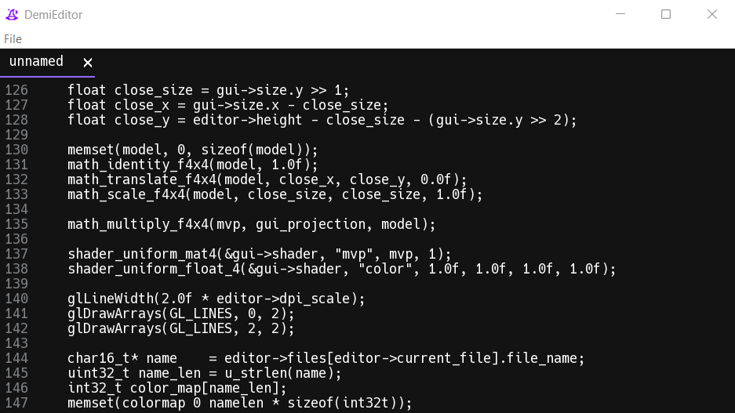

# Demi
A new (incomplete) GUI text edditor written in C.



## Table of Contents

- [credits](#credits)
- [shortcuts](#shortcuts)
- [project structure](#project-structure)
- [windows compilation ](#windows-compilation)
- [notes](#notes)

## credits
- magic_hat icon by [mingcute](https://www.mingcute.com/)
- jetbrains mono font
- freetype2
- glad2

## shortcuts

| shortcut | description     |
|----------|-----------------|
| ctrl+f   | new file        |
| ctrl+o   | open file       |
| ctrl+s   | save file       |
| ctrl+x   | copy and delete |
| ctrl+c   | copy            |
| ctrl+v   | paste           |
| ctrl+z   | undo            |
| ctrl+y   | redo            |
| ctrl+a   | select all      |
| ctrl+scroll     | horizontal scroll            |
| ctrl+key up     | go to the top of the file    |
| ctrl+key down   | go to the bottom of the file |
| shift+key left  | select text to the left      |
| shift+key right | select text to the right     |

## project structure

```bash
include.h        # defines, declarations, includes, typedefs and error.c
main.c           # declaration definitions, main, main loop, multithreaded helper func
main_helper.c    # parts of prepare from main.c abstracted into functions for readability
core/
├── demifile.c
├── demifile.h
├── editor.c
├── editor.h
├── font.c
├── font.h
├── gui.c
├── gui.h
├── render.c
├── render.h
├── string.c 
├── string.h     # StringBuffer and char16_t functions
├── color_map.c  # text highlighting logic
├── globjects.c
├── globjects.h  # shaders, vaos, vbos
├── math.c
├── math.h       # matrices
├── platform_layer.h
├── windows/
    ├── error.c  # message boxes and gl errors
    ├── file.c   # platform specific file logic
    ├── window.c # window creating and managing
```

## windows compilation 
requirements:
- clang-cl
- ninja
- glad2
- freetype2

```bash
cmake -S . -B build -G Ninja -DCMAKE_C_COMPILER=clang-cl ^
    -DCMAKE_BUILD_TYPE=Release ^
    -DGLAD_SRC="C:/libraries/glad/src/gl.c;C:/libraries/glad/src/wgl.c" ^
    -DGLAD_INCLUDE="C:/libraries/glad/include" ^
    -DFREETYPE_INCLUDE="C:/libraries/freetype/include/freetype2" ^
    -DFREETYPE_LIB="C:/libraries/freetype/lib/freetype.lib" 

ninja -C build -j 4
```

where CMakeLists always create both release and debug versions of demi; CMAKE_BUILD_TYPE affects flags for both.

### dependency installation

[LLVM clang-cl](https://clang.llvm.org/), which may require visual studio or it's build tools, more specifically:
- C++ development 
- C++ Clang Compiler for Windows
- MSBuild support for LLVM (clang-cli) toolset

> [!NOTE]
> Add LLVM's bin/ directory to your system PATH

install [glad2](https://gen.glad.sh/) to C:\libraries with the following settings:
- gl 4.6
- wgl 1.0 
- core
- WGL_ARB_pixel_format
- WGL_ARB_create_context,
- WGL_ARB_create_context_profile,
- WGL_ARB_multisample,
- WGL_EXT_swap_control,
- GL_EXT_texture_filter_anisotropic
- loader

build freetype from [source](https://gitlab.freedesktop.org/freetype/freetype)

> [!NOTE]
> There is no need to explicitly disable dependencies other than harfbuzz, do not fear the warnings.

```
cmake C:\Users\frogger\Downloads\freetype-master -G Ninja ^
    -DCMAKE_BUILD_TYPE=Release ^
    -DFT_DISABLE_HARFBUZZ=ON ^
    -DCMAKE_MSVC_RUNTIME_LIBRARY="MultiThreaded" ^
    -DCMAKE_BUILD_TYPE=Release ^
    -DBUILD_SHARED_LIBS=OFF ^
    -DCMAKE_AR="llvm-lib.exe" ^
    -DCMAKE_LINKER="lld-link.exe" ^
    -DCMAKE_C_COMPILER=clang-cl ^
    -DCMAKE_C_FLAGS="/MT /DNDEBUG /Ox /DFT_CONFIG_OPTION_AUTOHINT /DFT_CONFIG_OPTION_USE_LCD_FILTER /DFT_CONFIG_OPTION_SUBPIXEL_RENDERING /DFT_CONFIG_OPTION_INFINALITY_PATCHSET" ^
    -DCMAKE_INSTALL_PREFIX=C:\libraries\freetype

Ninja
Ninja install
```

## version history

`0.6` -> 
- compilation change from bat files to cmake
- rewriting color_map.c for lower ram usage
- adjusted color pallete
- horizontal scrolling
- new shorcuts

'0.7' ->
- select all (ctrl a)
- move to jetbrains mono font
- Demi continues the main loop only on input
- selecting text, ctrl x, ctrl c, shift+left/right key
- bugfix: texture_count was incorrect for GPUs with texture limit under 2000
- bugfix: pushing a string into undo/redo does not crash the program any longer
- bugfix: demi no longer leaves behind a frozen background process on WM_CLOSE and WM_DESTROY

plans for '0.8' ->
- settings menu
- linux support
- finish mouse support

## notes

- both GetKeyState and GetAsyncKeyState can freeze with false positives regarding alt until next key input, which I consistently replicated using alt + scroll wheel (win32)
- wchar_t and char16_t can be used interchangeably on windows
- WM_CLOSE and WM_DESTROY may crash the application when followed by return DefWindowProc(hwnd, msg, w_param, l_param) instead of return 0