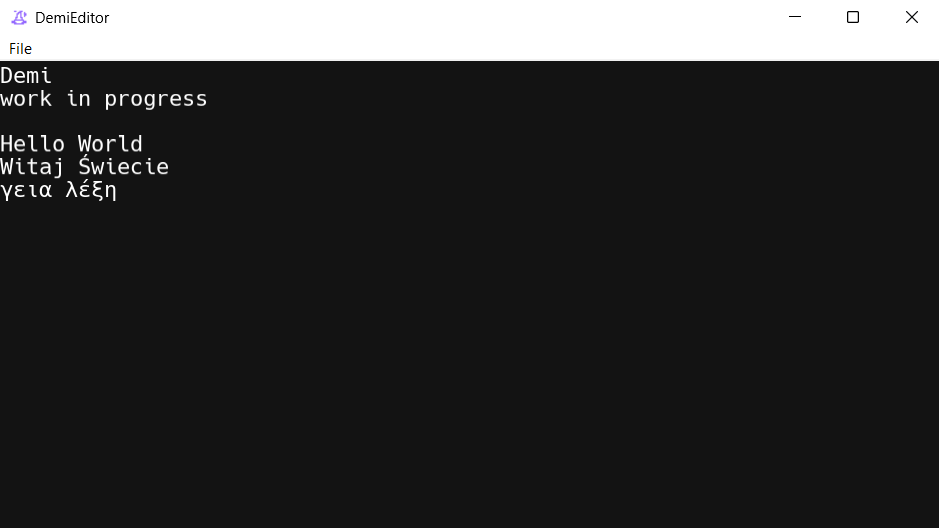

# Demi
A new (incomplete) GUI text edditor written in C. 



## Table of Contents

- [credits](#credits)
- [color pallete](#color-pallete)
- [project structure](#project-structure)
- [windows compilation ](#windows-compilation )

## credits
- magic_hat icon by [mingcute](https://www.mingcute.com/)
- [hack font](https://sourcefoundry.org/hack/)
- freetype2
- glad2

## color pallete
- background: 19, 19, 19
- keywords: 203, 195, 227
- variables: 240, 128, 0
- comments: 129, 133, 137

## project structure

```bash
include.h     #defines, includes, typedefs and error.c
main.c
core/
├── editor.c
├── editor.h
├── font.c
├── font.h
├── gui.c
├── gui.h
├── platform_layer.h
├── render.c
├── render.h
├── windows/
    ├── error.c
    ├── window.c
helper/
├── globjects.c
├── globjects.h
├── math.c
├── math.h
├── stringbuffer.c
├── stringbuffer.h
```

## windows compilation 
requirements:
- msvc c compiler
- glad2
- freetype2

my building setup (following it is optional):

I use [LLVM clang-cl](https://clang.llvm.org/), which requires visual studio or it's build tools, more specifically:
- C++ development 
- C++ Clang Compiler for Windows
- MSBuild support for LLVM (clang-cli) toolset

> [!NOTE]
> Add LLVM's bin/ directory to your system PATH

I install [glad2](https://gen.glad.sh/) to C:\libraries with the following settings:
- gl 4.6
- wgl 1.0 
- core
- WGL_ARB_create_context
- WGL_ARB_create_context_profile 
- WGL_ARB_pixel_format
- WGL_EXT_swap_control
- loader

I build freetype from [source](https://gitlab.freedesktop.org/freetype/freetype)

```
cmake C:\Users\frogger\Downloads\freetype-master -G Ninja ^
-DCMAKE_MSVC_RUNTIME_LIBRARY="MultiThreaded" ^
-DCMAKE_BUILD_TYPE=Release ^
-DBUILD_SHARED_LIBS=OFF ^
-DCMAKE_AR="llvm-lib.exe" ^
-DCMAKE_LINKER="lld-link.exe" ^
-DCMAKE_C_COMPILER=clang-cl ^
-DCMAKE_C_FLAGS="/MT /DNDEBUG /Ox" ^
-DFT_REQUIRE_ZLIB=OFF ^
-DFT_REQUIRE_PNG=OFF ^
-DFT_REQUIRE_BZIP2=OFF ^
-DFT_REQUIRE_HARFBUZZ=OFF ^
-DFT_REQUIRE_BROTLI=OFF ^
-DCMAKE_INSTALL_PREFIX=C:\libraries\freetype

Ninja
Ninja install
```