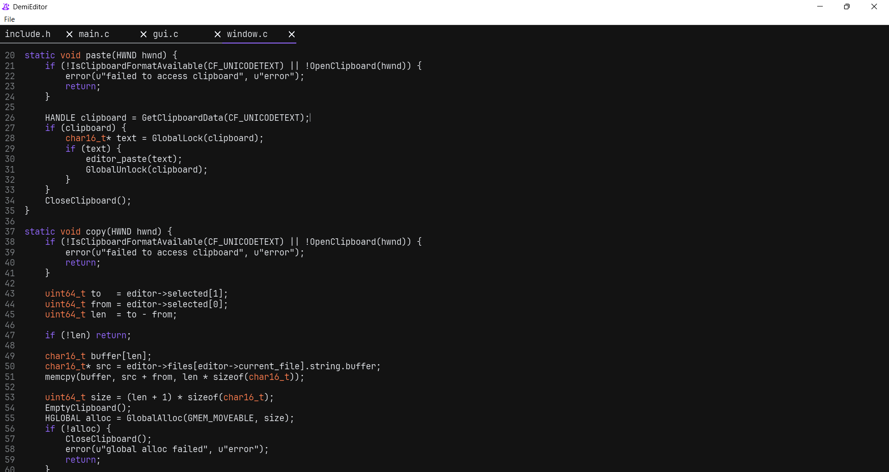

# Demi
A new (incomplete) GUI text edditor written in C.



## Table of Contents

- [credits](#credits)
- [shortcuts](#shortcuts)
- [project structure](#project-structure)
- [windows compilation ](#windows-compilation )

## credits
- magic_hat icon by [mingcute](https://www.mingcute.com/)
- [hack font](https://sourcefoundry.org/hack/)
- freetype2
- glad2

## shortcuts

| shortcut | description |
|----------|-------------|
| ctrl+s   | save file   |
| ctrl+v   | paste       |
| ctrl+z   | undo        |
| ctrl+y   | redo        |
| ctrl+key up | go to the top of the file |
| ctrl+key down | go to the bottom of the file |

## project structure

```bash
include.h        # defines, declarations, includes, typedefs and error.c
main.c           # declaration definitions, main, main loop, multithreaded helper func
main_helper.c    # parts of prepare from main.c abstracted into functions for readability
core/
├── editor.c
├── editor.h
├── font.c
├── font.h
├── gui.c
├── gui.h
├── render.c
├── render.h
├── string.c 
├── string.h     # StringBuffer and char16_t functions
├── color_map.c  # text highlighting logic
├── globjects.c
├── globjects.h  # shaders, vaos, vbos
├── math.c
├── math.h       # matrices
├── platform_layer.h
├── windows/
    ├── error.c  # message boxes and gl errors
    ├── file.c   # file opening, saving and closing
    ├── window.c # window creating and managing
```

## windows compilation 
requirements:
- msvc c compiler
- glad2
- freetype2

my building setup (following it is optional):

[LLVM clang-cl](https://clang.llvm.org/), which requires visual studio or it's build tools, more specifically:
- C++ development 
- C++ Clang Compiler for Windows
- MSBuild support for LLVM (clang-cli) toolset

> [!NOTE]
> Add LLVM's bin/ directory to your system PATH

install [glad2](https://gen.glad.sh/) to C:\libraries with the following settings:
- gl 4.6
- wgl 1.0 
- core
- WGL_ARB_pixel_format
- WGL_ARB_create_context,
- WGL_ARB_create_context_profile,
- WGL_ARB_multisample,
- WGL_EXT_swap_control,
- GL_EXT_texture_filter_anisotropic
- loader

build freetype from [source](https://gitlab.freedesktop.org/freetype/freetype)

> [!NOTE]
> There is no need to explicitly disable dependencies other than harfbuzz, do not fear the warnings.

```
cmake C:\Users\frogger\Downloads\freetype-master -G Ninja ^
-DFT_DISABLE_HARFBUZZ=ON ^
-DCMAKE_MSVC_RUNTIME_LIBRARY="MultiThreaded" ^
-DCMAKE_BUILD_TYPE=Release ^
-DBUILD_SHARED_LIBS=OFF ^
-DCMAKE_AR="llvm-lib.exe" ^
-DCMAKE_LINKER="lld-link.exe" ^
-DCMAKE_C_COMPILER=clang-cl ^
-DCMAKE_C_FLAGS="/MT /DNDEBUG /Ox /DFT_CONFIG_OPTION_AUTOHINT /DFT_CONFIG_OPTION_USE_LCD_FILTER /DFT_CONFIG_OPTION_SUBPIXEL_RENDERING /DFT_CONFIG_OPTION_INFINALITY_PATCHSET" ^
-DCMAKE_INSTALL_PREFIX=C:\libraries\freetype

Ninja
Ninja install
```